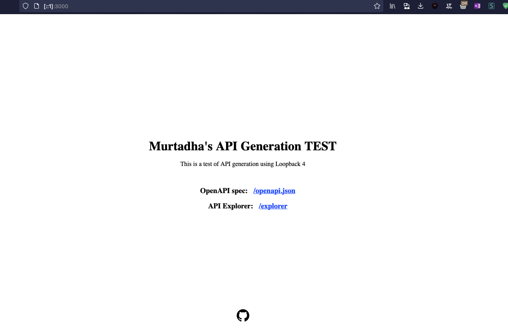
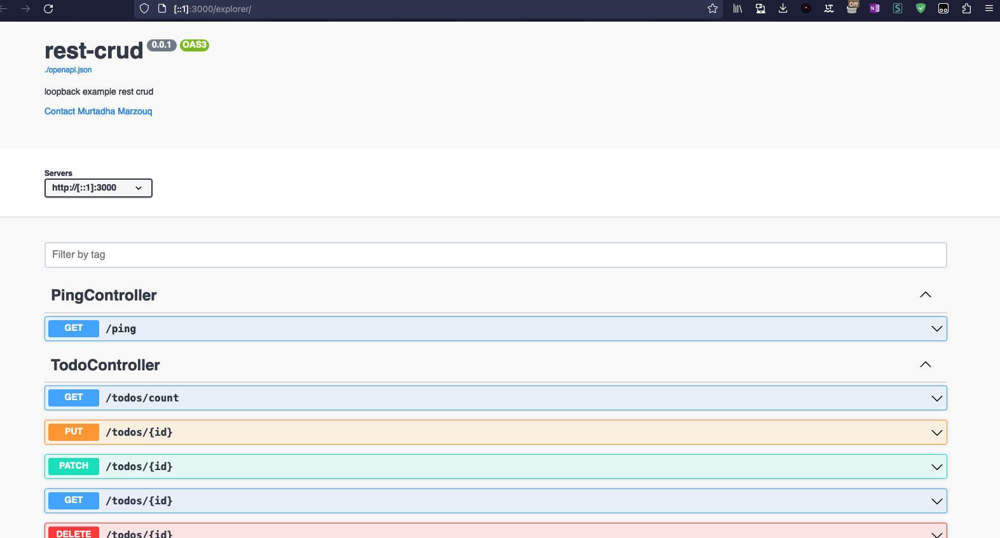
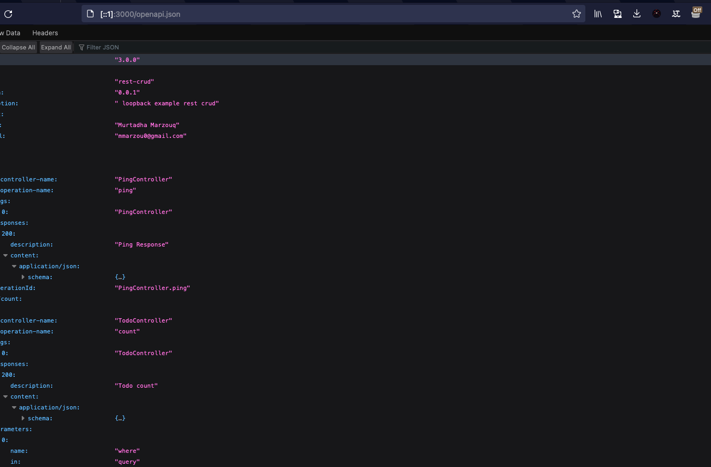

# API Generators

This is a Test Project for API Generators using lb4 aka Loopback 4

## Installation

```bash
npm install
```

## Running the app

```bash
# development
npm run start
```

## Screenshots

### API Explorer


### Swagger UI



### JSON SPEC FILE


## License
Apache-2.0

## Author
Murtadha Marzouq
